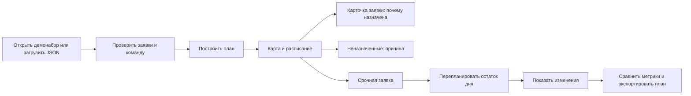

# Пользовательский путь диспетчера

## Главная задача

За несколько минут получить выполнимый план рабочего дня, проверить исключения и понять последствия срочной заявки.

## Экран «Рабочий день»

Основное действие до расчёта — «Построить план», после — «Событие дня». Верхние карточки отвечают на четыре вопроса: сколько заявок назначено, сколько инженеров нужно, какой пробег и сколько исключений осталось. Карта и список маршрутов работают совместно: выбор инженера выделяет его маршрут, выбор точки открывает заявку. Переключение на расписание даёт контроль временных окон.

Важные исключения видны прямо под картой и доступны через карточку «Требуют внимания». Статус передаётся текстом и символами, не только цветом.

## Карточка заявки

Сначала адрес и статус, затем требования, исполнитель и время. Объяснение связано с конкретными полями: навык, транспорт, начало в окне, конец до окончания смены, время от предыдущей точки. Неназначенной заявке не придумывается исполнитель: показана причина и направление проверки.

## Событие дня

В MVP один сценарий — срочная аварийная заявка. Диспетчер видит адрес, требования, время события, окно и длительность до запуска перерасчёта. После расчёта открывается новая заявка, а раздел эффективности хранит таблицу изменений. Повторное создание той же заявки заблокировано; доступен переход к сравнению или сброс демо.

## Второстепенные экраны

| Экран         | Зачем нужен                                    | Действие                                 |
| ------------- | ---------------------------------------------- | ---------------------------------------- |
| Заявки        | Найти адрес, проверить требования и исключения | Поиск, фильтры, карточка                 |
| Инженеры      | Проверить ресурсы и увидеть резерв             | Навыки/смена/транспорт, переход на карту |
| Эффективность | Убедиться, что расчёт можно сравнить с базовым | Общие метрики, пробег каждого, diff      |
| Загрузка      | Выбрать данные без настройки интеграции        | Пример JSON, проверка ошибки, демонабор  |

## Состояния, которые нужно сохранить при подключении бэкенда

- Нет плана: входные данные видны, метрики не выдумываются.
- Расчёт: основное действие заблокировано, отображается индикатор загрузки.
- Ошибка: понятное сообщение, входные данные и предыдущий план сохраняются.
- Неполный план: список неназначенных доступен вместе с успешными маршрутами.
- Пустой результат поиска: можно сбросить запрос и фильтры.
- Ошибка формата импорта: текущий набор не заменяется.
- Нет сети для карты: точки доступны на сетке, показана причина отсутствия подложки.
- Мобильный экран: меню раскрывается, таблицы имеют собственную горизонтальную прокрутку, карточка заявки открывается на всю ширину.

## Быстрая проверка UX на команде

Дать участнику пять заданий без подсказок: построить план, найти неназначенную заявку, объяснить назначение другой, добавить срочную, найти изменившегося исполнителя/время. Записать, где он остановился или ошибся. Проверить читаемость на проекторе и ноутбуке 1366×768. После обсуждения сначала исправлять затруднения в основном сценарии, затем косметику.
